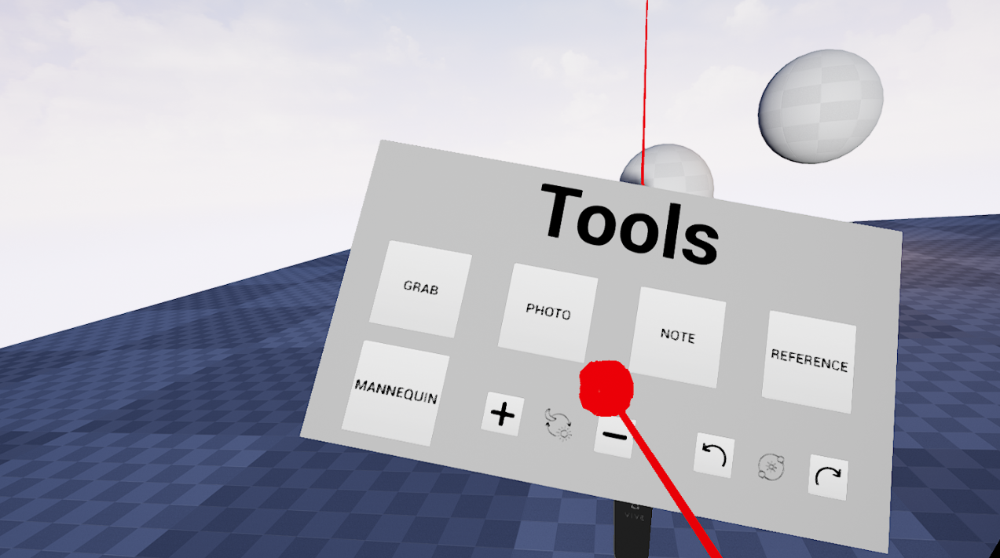
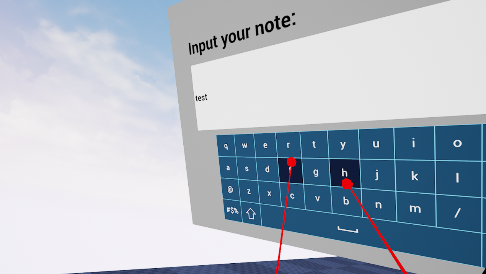
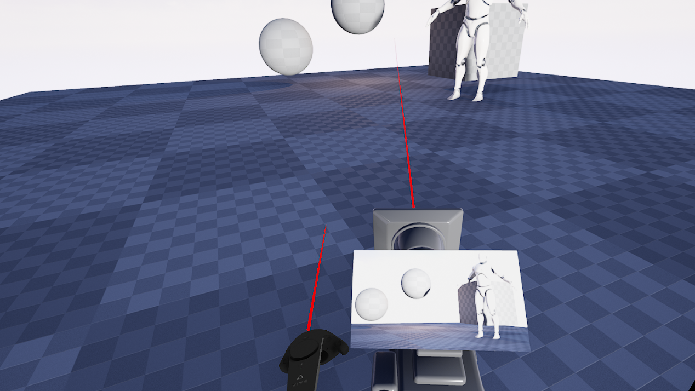
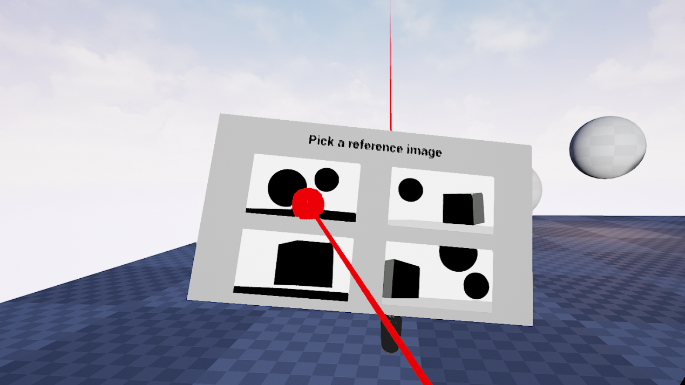
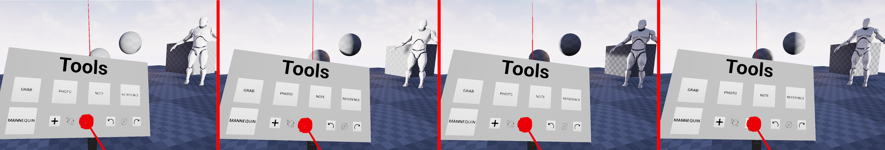

# [Storyboarding in VR](https://is.czu.cz/zp/index.pl?prehled=vyhledavani;podrobnosti_zp=301289;zp=301289;dinfo_jazyk=1;lang=cz)
Unreal Engine plugin enabling the creation of as many parts of the storyboarding workflow as possible in VR, without the need 
to take off the headset, namely:
* Grab objects that are children of a custom Interactable Object Class.
* Take a photo of the scene.
* Write a note with automatic timestamping.
* Open a reference image inside VR.
* Create and place down a mannequin in the scene.
* Rotate position of the sun horizontally and vertically in order to bettter approximate time of the day.

Video: https://youtu.be/dFLagzxmiPQ

